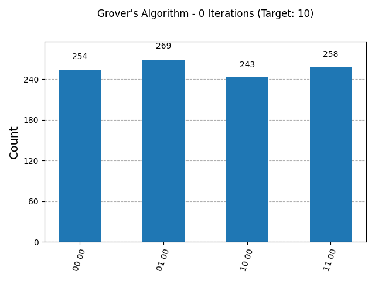
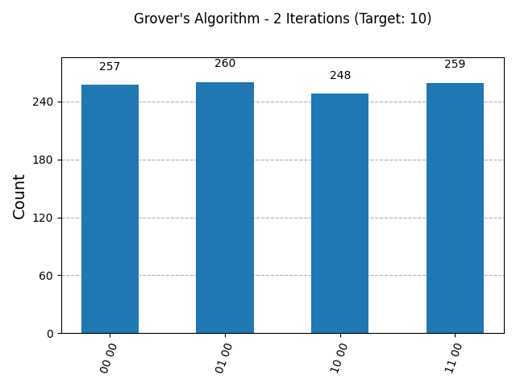

# Grover's Search Algorithm for 4-Item Database

## Description

This project implements Grover's Search Algorithm for a 4-item database using Qiskit. Grover's algorithm demonstrates quantum speedup by finding a marked item in an unsorted database with O(sqrt(N)) queries, where N is the number of items.

For N=4 (2 qubits), the algorithm optimally requires 1 iteration to amplify the probability of the target state.

## Skills Demonstrated

- Oracle design: Creating a phase oracle to mark the target state.
- Amplitude amplification: Implementing the diffusion operator.
- Circuit iteration and optimization: Building and iterating the quantum circuit.

## Prerequisites

- Python 3.x
- Qiskit
- Qiskit Aer
- Matplotlib

Install dependencies:

```bash
pip install -r requirements.txt
```

Or manually:

```bash
pip install qiskit qiskit-aer matplotlib
```

## How to Run

1. Clone or download the repository.
2. Run the script:

```bash
python grover_search.py
```

The script simulates the algorithm for different target states ('00', '01', '10', '11') and various iterations (0 to 4), displaying the probability distributions and saving histograms as PNG files.

## Results

### Example Output for Target '11'

```
Iterations: 0
Counts: {'10 00': 261, '00 00': 266, '11 00': 249, '01 00': 248}
Iterations: 1
Counts: {'11 00': 1024}
Iterations: 2
Counts: {'10 00': 257, '00 00': 252, '01 00': 252, '11 00': 263}
Iterations: 3
Counts: {'00 00': 250, '10 00': 279, '01 00': 247, '11 00': 248}
Iterations: 4
Counts: {'11 00': 1024}
```

This demonstrates the oscillation: uniform at 0, amplified at 1, uniform at 2, uniform at 3, amplified at 4.

This shows the characteristic oscillation of Grover's algorithm, with probability peaking at odd iterations.

### Visualizations

Histograms are saved as `grover_{iterations}_iterations.png` for each simulation.

#### Iteration 0 (Uniform Superposition)


#### Iteration 1 (Amplified Target)


#### Iteration 2 (Back to Uniform)


### Circuit Diagram

The script also prints the quantum circuit diagram for 1 iteration.

## Files

- `grover_search.py`: Main implementation script
- `requirements.txt`: Python dependencies
- `TODO.md`: Development notes
- `grover_*.png`: Generated histograms

## GitHub Deployment

This is a standalone Python script. To deploy on GitHub:

1. Upload the files to a GitHub repository.
2. Add the README.md for documentation.
3. Users can clone the repo and run the script locally.

For web-based visualization, consider integrating with Jupyter notebooks or a web framework.
